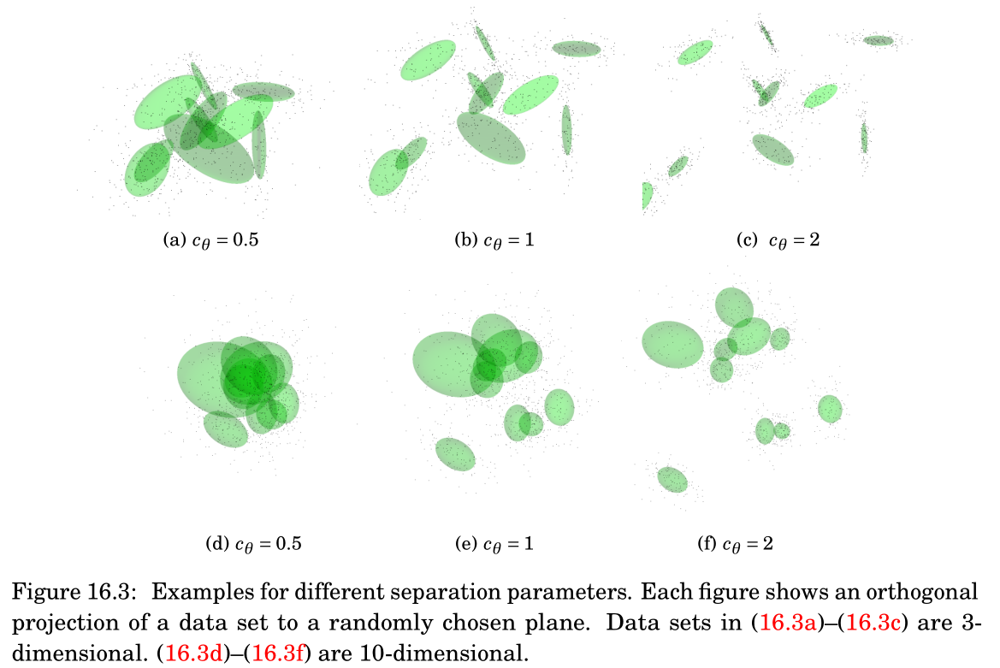

## GMM Laboratory

a laboratory for model based clustering with Gaussian mixture models

* various initialization methods for the EM algorithm for GMMs (DOI: [10.1007/978-3-319-31750-2_24](https://doi.org/10.1007/978-3-319-31750-2_24))


* visualization (gmmlab)


* automatic evaluation with respect to a large number of data sets (testlab)


## Generation of Artificial Data Sets

We generate data sets by drawing points according to randomly generated GMMs. However, we control
the following four properties of the GMMs:
1. Gaussian components can either be spherical or elliptical. We describe
the eccentricity of the k-th covariance matrix by 

   
   
   
   where  denotes the d-th eigenvalue of the k-th covariance matrix. 
2.  Components can have different sizes, in terms of the smallest eigenvalue of the corresponding
covariance matrices.
3. The components can have (very) different or uniform mixture weights.
4. The components can overlap more or less. Following the work of [Sanjoy Dasgupta: Learning Mixtures of Gaussians. FOCS 1999: 634-644], we define the separation parameter as follows:

   



   
With these properties of a GMMs in mind, we generate the parameters of a GMM as follows: Initially,we draw K mean vectors independently uniformly at random from a cube with a fixed side length. For the weights, we fix some weight constant W ≥ 0, construct a set of weights 

   
   
and assign these weights randomly to the components. To control the sizes and the eccentricity, we fix a minimum and maximum
eigenvalue and draw the remaining values uniformly at random from the interval between them. Then, we draw a random orthonormal matrix Q and set .  
Finally, the mean vectors are scaled as to fit the predefined separation parameter c. 

## Getting Started


### Requirements


* Compiler: gcc 4.7.1 (or higher)
* Eigen3
  * available at http://eigen.tuxfamily.org
  * download and unzip Eigen3.1.4 (or higher)
  * copy subfolder "Eigen" somewhere where the compiler can find it, e.g., in /usr/local/include/
* GLFW
  * available at http://www.glfw.org
  * unzip and then:
````
   cd GLFWfolder
   cmake . 
   make
   sudo make install
````
* AntTweakBar
  * available at http://anttweakbar.sourceforge.net
  * unzip and then:
````
  cd AntTweakBar/src
  make 
````
  * copy header files from AntTweakBar/include e.g. to /usr/local/include
  * copy libraries from AntTweakBar/lib e.g. to  /usr/local/lib
  
* premake4
  * available at http://industriousone.com/premake
  
    
### Compile & Run

Sourcecode provided on this webpage comes without any warranty. Use at your own risk. 

````
premake4 gmake 
cd build
make gmmlab
make testlab

./gmmlab --config config/gmmlab/gmmlab.cfg
````

