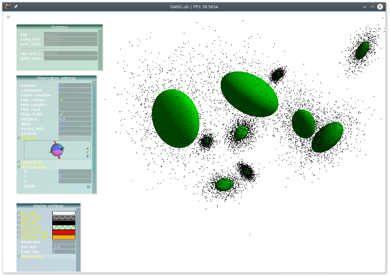

## GMM Laboratory

a laboratory for model based clustering with Gaussian mixture models

* various initialization methods for the EM algorithm for GMMs (DOI: [10.1007/978-3-319-31750-2_24](https://doi.org/10.1007/978-3-319-31750-2_24))


* visualization (gmmlab)


* automatic evaluation with respect to a large number of data sets (testlab)


## Getting Started


### Requirements


* Compiler: gcc 4.7.1 (or higher)
* Eigen3
  * available at http://eigen.tuxfamily.org
  * download and unzip Eigen3.1.4 (or higher)
  * copy subfolder "Eigen" somewhere where the compiler can find it, e.g., in /usr/local/include/
* GLFW
  * available at http://www.glfw.org
  * unzip and then:
````
   cd GLFWfolder
   cmake . 
   make
   sudo make install
````
* AntTweakBar
  * available at http://anttweakbar.sourceforge.net
  * unzip and then:
````
  cd AntTweakBar/src
  make 
````
  * copy header files from AntTweakBar/include e.g. to /usr/local/include
  * copy libraries from AntTweakBar/lib e.g. to  /usr/local/lib
  
* premake4
  * available at http://industriousone.com/premake
  
    
### Compile & Run

Sourcecode provided on this webpage comes without any warranty. Use at your own risk. 

````
premake4 gmake 
cd build
make gmmlab
make testlab

./gmmlab --config config/gmmlab/gmmlab.cfg
````

